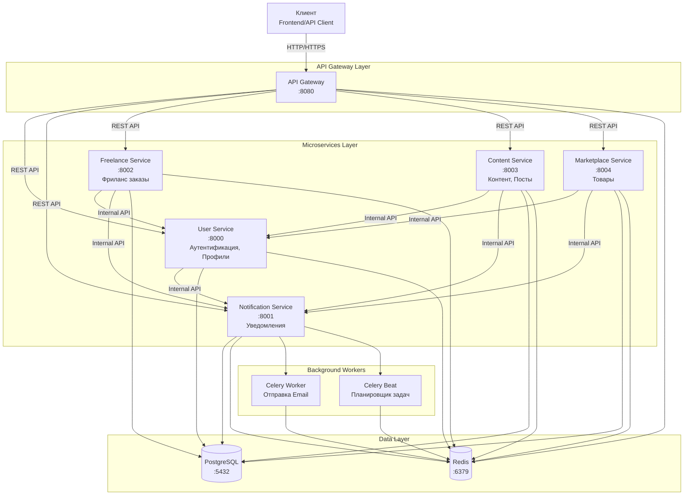
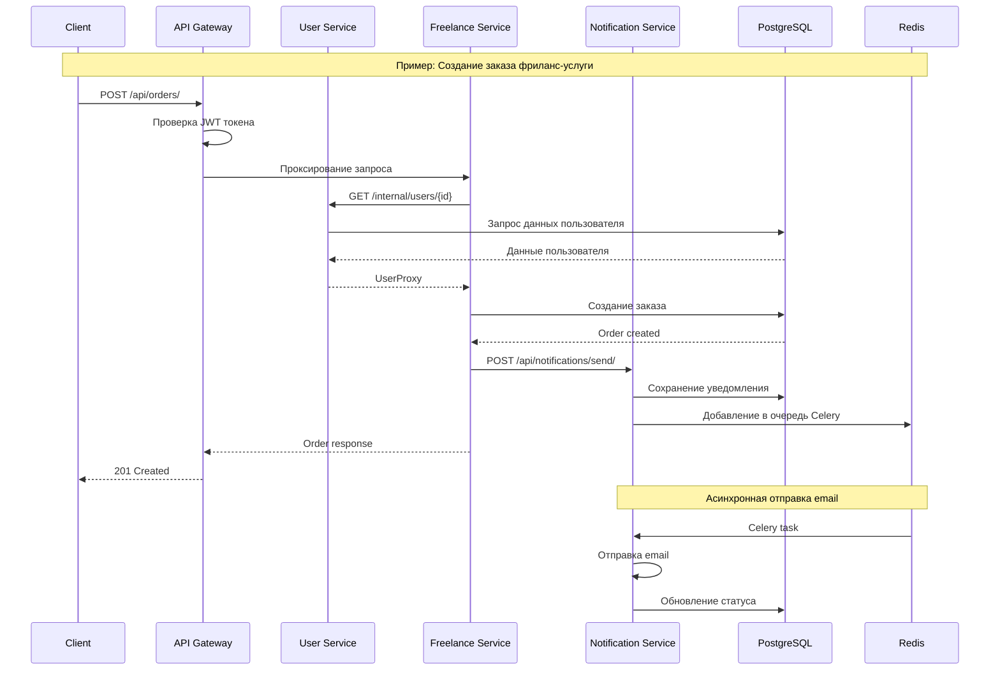
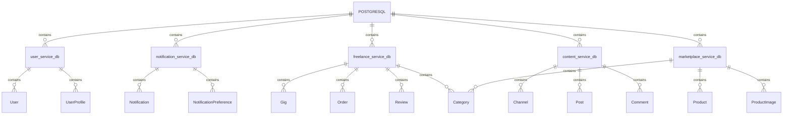

# Архитектура микросервисной платформы

## Обзор системы

Платформа представляет собой распределенную микросервисную архитектуру, состоящую из 6 специализированных сервисов, объединенных через API Gateway. Система реализована на Django 5.2.5 с использованием PostgreSQL для хранения данных, Redis для кэширования и очередей задач.

## Архитектурная диаграмма



## Диаграмма взаимодействия сервисов



## Базы данных

Каждый микросервис имеет собственную изолированную базу данных (Database per Service pattern):



## Использование Redis

Redis используется для нескольких целей с разделением по базам данных:

| База Redis | Сервис | Назначение |
|-----------|--------|------------|
| DB 0 | API Gateway | Rate limiting, кэш маршрутизации |
| DB 1 | User Service | Сессии, кэш профилей |
| DB 2 | Content Service | Кэш постов и каналов |
| DB 3 | Notification Service | Celery broker/backend, очереди задач |
| DB 4 | Freelance Service | Кэш услуг и заказов |
| DB 5 | Marketplace Service | Кэш товаров |

## Компоненты системы

### API Gateway
**Назначение:** Единая точка входа для всех клиентов
- Маршрутизация запросов к микросервисам
- JWT аутентификация
- Rate limiting
- Логирование запросов
- CORS управление

### User Service
**Назначение:** Управление пользователями и аутентификация
- Регистрация и аутентификация пользователей
- Управление профилями
- Управление ролями (freelancer, seller, moderator)
- Выдача JWT токенов
- Интеграция с Notification Service

### Notification Service
**Назначение:** Централизованная система уведомлений
- Email уведомления (через Celery)
- In-app уведомления
- Push уведомления (поддержка)
- Управление настройками уведомлений
- Асинхронная обработка через Celery Workers

### Freelance Service
**Назначение:** Платформа фриланс-услуг
- Управление услугами (gigs) и пакетами
- Система заказов
- Отзывы и рейтинги
- Портфолио фрилансеров
- Поиск и категории услуг
- Аналитика

### Content Service
**Назначение:** Платформа контента и каналов
- Создание и управление каналами
- Публикация постов
- Система комментариев (древовидная структура)
- Лайки и взаимодействия
- Управление членством в каналах

### Marketplace Service
**Назначение:** Маркетплейс товаров
- Управление товарами
- Категории товаров
- Избранное
- Поиск товаров
- Отзывы на товары

## Паттерны и принципы

### Используемые паттерны

1. **API Gateway Pattern**
   - Единая точка входа для всех клиентов
   - Упрощение клиентского кода
   - Централизованная аутентификация

2. **Database per Service**
   - Каждый сервис имеет собственную БД
   - Изоляция данных
   - Независимое масштабирование

3. **Event-Driven Architecture**
   - Асинхронные уведомления через Celery
   - Отложенная обработка задач
   - Разделение ответственности

4. **Service Discovery через Environment Variables**
   - Конфигурация URL сервисов через переменные окружения
   - Гибкая настройка в Docker

5. **Health Check Pattern**
   - Каждый сервис предоставляет endpoint для проверки здоровья
   - Мониторинг доступности сервисов

### Принципы проектирования

1. **Single Responsibility Principle**
   - Каждый микросервис отвечает за одну бизнес-область

2. **Loose Coupling**
   - Сервисы взаимодействуют через REST API
   - Независимое развертывание

3. **High Cohesion**
   - Связанная функциональность группируется в одном сервисе

4. **Fault Isolation**
   - Падение одного сервиса не влияет на остальные
   - Health checks для мониторинга

## Масштабируемость

### Горизонтальное масштабирование

Каждый микросервис может масштабироваться независимо:

```yaml
# Пример масштабирования в docker-compose
user-service:
  deploy:
    replicas: 3
```

### Вертикальное масштабирование

Настройка ресурсов на уровне контейнера:

```yaml
user-service:
  deploy:
    resources:
      limits:
        cpus: '2'
        memory: 2G
```

### Кэширование

- Redis для кэширования данных
- Снижение нагрузки на базу данных
- Ускорение ответов API

## Безопасность

### Аутентификация
- JWT токены (access + refresh)
- Token blacklist для logout
- Кастомные декораторы для проверки прав

### Авторизация
- Role-based access control (RBAC)
- Декораторы: `@public_endpoint`, `@staff_required`, `@owner_or_staff_required`

### Сетевая безопасность
- Микросервисы работают в изолированной Docker сети
- Только API Gateway доступен извне
- Внутренние сервисы доступны только через Gateway

### Защита данных
- PostgreSQL с аутентификацией
- Переменные окружения для секретов
- Отдельные базы данных для каждого сервиса

## Мониторинг и логирование

### Health Checks
Каждый сервис предоставляет endpoint:
```
GET /api/health/
```

Возвращает:
```json
{
  "status": "healthy",
  "service": "user-service",
  "timestamp": "2025-12-04T10:00:00Z",
  "database": "connected",
  "redis": "connected"
}
```

### Логирование
- Централизованное логирование через middleware
- Логи запросов и ответов
- Логи ошибок и исключений

## Технологический стек

| Компонент | Технология | Версия |
|-----------|-----------|--------|
| Framework | Django | 5.2.5 |
| API | Django REST Framework | 3.14.0 |
| Database | PostgreSQL | 16-alpine |
| Cache/Queue | Redis | 7-alpine |
| Task Queue | Celery | 5.3.4 |
| WebSockets | Channels | 4.0.0 |
| Auth | JWT | PyJWT 2.10.1 |
| WSGI Server | Gunicorn | 21.2.0 |
| Container | Docker | Latest |
| Orchestration | Docker Compose | Latest |
| Language | Python | 3.11-slim |

## Развертывание

Система развертывается с помощью Docker Compose:

```bash
# Запуск всех сервисов
docker-compose up -d

# Масштабирование конкретного сервиса
docker-compose up -d --scale user-service=3
```

## Будущие улучшения

1. **Service Mesh**
   - Внедрение Istio или Linkerd
   - Улучшенный мониторинг и трейсинг

2. **Message Broker**
   - RabbitMQ или Kafka для event-driven коммуникации
   - Более надежная интеграция между сервисами

3. **API Versioning**
   - Версионирование API endpoints
   - Обратная совместимость

4. **Circuit Breaker**
   - Защита от каскадных сбоев
   - Graceful degradation

5. **Distributed Tracing**
   - Jaeger или Zipkin
   - Отслеживание запросов через сервисы

6. **Kubernetes**
   - Миграция с Docker Compose на K8s
   - Автоматическое масштабирование
   - Лучшая оркестрация
